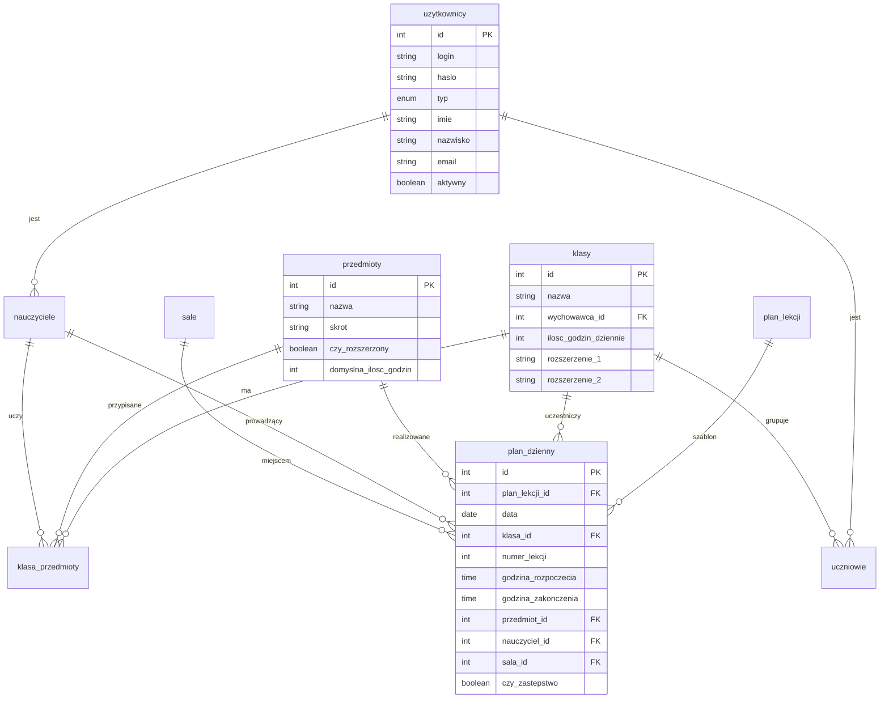

# LibreLessons - System Zarządzania Planem Lekcji


## Spis treści
- [Wprowadzenie](#wprowadzenie)
- [Główne funkcje](#główne-funkcje)
- [Wymagania systemowe](#wymagania-systemowe)
- [Instalacja](#instalacja)
  - [Instalacja na Ubuntu Server](#instalacja-na-ubuntu-server)
  - [Instalacja na Windows (XAMPP)](#instalacja-na-windows-xampp)
  - [Instalacja za pomocą Dockera](#instalacja-za-pomocą-dockera)
- [Konfiguracja](#konfiguracja)
- [Pierwsze kroki](#pierwsze-kroki)
- [Architektura systemu](#architektura-systemu)
- [Dla deweloperów](#dla-deweloperów)
- [Bezpieczeństwo](#bezpieczeństwo)
- [Rozwiązywanie problemów](#rozwiązywanie-problemów)
- [Współpraca](#współpraca)
- [Licencja](#licencja)

---

## Wprowadzenie

**LibreLessons** to otwarty system zarządzania planem lekcji dla szkół, napisany w PHP z wykorzystaniem bazy danych MySQL/MariaDB. System umożliwia kompleksowe zarządzanie organizacją zajęć szkolnych, w tym automatyczne generowanie planów, zarządzanie zastępstwami i obsługę wielorolnych użytkowników.

**Wersja dokumentacji:** 4.1  
**Wersja systemu:** 4.1  
**Data aktualizacji:** 2025-12-18

---

## Główne funkcje

### Podstawowe funkcjonalności
- **Automatyczne generowanie planu lekcji** dla wszystkich klas z zaawansowanym algorytmem
- **Zarządzanie zastępstwami** za nieobecnych nauczycieli
- **Przeglądanie planu** przez uczniów, nauczycieli i dyrekcję
- **Zarządzanie kalendarzem dni wolnych** i świąt
- **Przypisywanie nauczycieli** do przedmiotów i klas
- **Zarządzanie salami lekcyjnymi** i ich przydzielaniem

### Zaawansowane funkcje (wersja 4.0+)
- **System ocen** z kategoriami wagowymi i statystykami
- **Wewnętrzny system wiadomości** z załącznikami
- **Import/Export danych** w formatach CSV i XLSX
- **Statystyki i raporty** dla dyrekcji

---

## Wymagania systemowe

### Minimalne wymagania (serwer)
| Komponent | Minimalne | Zalecane |
|-----------|-----------|----------|
| Procesor | 1 rdzeń | 2+ rdzenie |
| RAM | 512 MB | 1 GB+ |
| Dysk | 100 MB | 500 MB+ |
| System | Linux/Windows | Ubuntu Server 22.04+ |

### Wymagane oprogramowanie
| Program | Wersja | Uwagi |
|---------|--------|-------|
| PHP | 8.2+ | z rozszerzeniami: mysqli, session, json, mbstring |
| MySQL | 8.0+ | lub MariaDB 10.4+ |
| Serwer WWW | Apache 2.4+ | lub Nginx 1.18+ |

### Wspierane przeglądarki
- Chrome 90+
- Firefox 88+
- Safari 14+
- Edge 90+

---

## Instalacja

### Instalacja na Ubuntu Server

#### Krok 1: Aktualizacja systemu
```bash
sudo apt update && sudo apt upgrade -y
```

#### Krok 2: Instalacja Apache2
```bash
sudo apt install apache2 -y
sudo systemctl enable apache2
sudo systemctl start apache2
```

#### Krok 3: Instalacja MySQL
```bash
sudo apt install mysql-server -y
sudo systemctl enable mysql
sudo systemctl start mysql
sudo mysql_secure_installation
```

#### Krok 4: Instalacja PHP i rozszerzeń
```bash
sudo apt install php php-mysqli php-cli libapache2-mod-php php-json php-mbstring -y
```

#### Krok 5: Pobranie LibreLessons
```bash
cd /var/www/html
sudo curl -L https://github.com/tresdeliquentes11-byte/librelessons/archive/refs/heads/main.zip -o librelessons.zip
sudo apt install unzip -y
sudo unzip librelessons.zip
sudo mv librelessons-main librelessons
sudo rm librelessons.zip
```

#### Krok 6: Ustawienie uprawnień
```bash
sudo chown -R www-data:www-data /var/www/html/librelessons
sudo chmod -R 755 /var/www/html/librelessons
```

#### Krok 7: Konfiguracja bazy danych
```bash
sudo mysql -u root -p
```
```sql
CREATE DATABASE plan_lekcji CHARACTER SET utf8mb4 COLLATE utf8mb4_general_ci;
CREATE USER 'librelessons'@'localhost' IDENTIFIED BY 'TwojeHaslo123!';
GRANT ALL PRIVILEGES ON plan_lekcji.* TO 'librelessons'@'localhost';
FLUSH PRIVILEGES;
EXIT;
```

#### Krok 8: Import bazy danych
```bash
sudo mysql -u librelessons -p plan_lekcji < /var/www/html/librelessons/database.sql
```

#### Krok 9: Konfiguracja połączenia
Edytuj plik konfiguracyjny:
```bash
sudo nano /var/www/html/librelessons/includes/config.php
```

Zmień parametry połączenia:
```php
define('DB_HOST', 'localhost');
define('DB_USER', 'librelessons');
define('DB_PASS', 'TwojeHaslo123!');
define('DB_NAME', 'plan_lekcji');
```

#### Krok 10: Restart Apache
```bash
sudo systemctl restart apache2
```

#### Krok 11: Weryfikacja instalacji
Otwórz przeglądarkę i wejdź na:
```
http://ADRES_IP_SERWERA/librelessons
```

### Instalacja na Windows (XAMPP)

#### Krok 1: Pobierz i zainstaluj XAMPP
1. Pobierz XAMPP z [https://www.apachefriends.org](https://www.apachefriends.org)
2. Uruchom instalator i zainstaluj w domyślnej lokalizacji (`C:\xampp`)
3. Podczas instalacji zaznacz komponenty: **Apache**, **MySQL**, **PHP**

#### Krok 2: Uruchom XAMPP
1. Otwórz **XAMPP Control Panel**
2. Kliknij **Start** przy **Apache**
3. Kliknij **Start** przy **MySQL**

#### Krok 3: Pobierz LibreLessons
1. Pobierz ZIP z repozytorium: [https://github.com/tresdeliquentes11-byte/librelessons/archive/refs/heads/main.zip](https://github.com/tresdeliquentes11-byte/librelessons/archive/refs/heads/main.zip)
2. Rozpakuj archiwum
3. Zmień nazwę folderu `librelessons-main` na `librelessons`
4. Przenieś folder `librelessons` do `C:\xampp\htdocs\`

#### Krok 4: Konfiguracja bazy danych
1. Otwórz przeglądarkę i wejdź na: `http://localhost/phpmyadmin`
2. Kliknij **Nowa** (po lewej stronie)
3. Wpisz nazwę bazy: `plan_lekcji`
4. Wybierz kodowanie: `utf8mb4_general_ci`
5. Kliknij **Utwórz**
6. W phpMyAdmin wybierz bazę `plan_lekcji`
7. Kliknij zakładkę **Import**
8. Kliknij **Wybierz plik** i wskaż: `C:\xampp\htdocs\librelessons\database.sql`
9. Kliknij **Wykonaj**

#### Krok 5: Konfiguracja połączenia
1. Otwórz plik `C:\xampp\htdocs\librelessons\includes\config.php` w edytorze tekstu
2. Ustaw parametry (domyślnie XAMPP nie ma hasła):
```php
define('DB_HOST', 'localhost');
define('DB_USER', 'root');
define('DB_PASS', '');
define('DB_NAME', 'plan_lekcji');
```

#### Krok 6: Dostęp do systemu
Otwórz przeglądarkę i wejdź na:
```
http://localhost/librelessons
```

### Instalacja za pomocą Dockera

#### Krok 1: Stwórz plik Dockerfile
```dockerfile
FROM php:8.2-apache

RUN apt-get update && apt-get install -y \
    default-mysql-client \
    libzip-dev \
    zip \
    && docker-php-ext-install mysqli pdo pdo_mysql zip

RUN a2enmod rewrite

COPY . /var/www/html/
RUN chown -R www-data:www-data /var/www/html
```

#### Krok 2: Stwórz plik docker-compose.yml
```yaml
version: '3.8'
services:
  web:
    build: .
    ports:
      - "8080:80"
    depends_on:
      - db
    environment:
      - DB_HOST=db
      - DB_USER=librelessons
      - DB_PASS=password
      - DB_NAME=plan_lekcji
    volumes:
      - .:/var/www/html

  db:
    image: mysql:8.0
    environment:
      MYSQL_ROOT_PASSWORD: rootpassword
      MYSQL_DATABASE: plan_lekcji
      MYSQL_USER: librelessons
      MYSQL_PASSWORD: password
    volumes:
      - db_data:/var/lib/mysql
      - ./database.sql:/docker-entrypoint-initdb.d/database.sql

volumes:
  db_data:
```

#### Krok 3: Uruchom kontenery
```bash
docker-compose up -d
```

---

## Konfiguracja

### Konfiguracja serwera Apache

#### Wirtualny host (Ubuntu)
Stwórz plik `/etc/apache2/sites-available/librelessons.conf`:
```apache
<VirtualHost *:80>
    ServerName your-domain.com
    DocumentRoot /var/www/html/librelessons
    
    <Directory /var/www/html/librelessons>
        AllowOverride All
        Require all granted
    </Directory>
    
    ErrorLog ${APACHE_LOG_DIR}/librelessons_error.log
    CustomLog ${APACHE_LOG_DIR}/librelessons_access.log combined
</VirtualHost>
```

Aktywuj host:
```bash
sudo a2ensite librelessons
sudo a2enmod rewrite
sudo systemctl reload apache2
```

### Konfiguracja SSL (HTTPS)

#### Użycie Let's Encrypt (Ubuntu)
```bash
sudo apt install certbot python3-certbot-apache
sudo certbot --apache -d your-domain.com
```

### Konfiguracja kopii zapasowych

#### Automatyczny backup bazy danych
Stwórz skrypt `/usr/local/bin/backup-librelessons.sh`:
```bash
#!/bin/bash
DATE=$(date +%Y%m%d_%H%M%S)
BACKUP_DIR="/var/backups/librelessons"
DB_NAME="plan_lekcji"
DB_USER="librelessons"
DB_PASS="TwojeHaslo123!"

mkdir -p $BACKUP_DIR

# Backup bazy danych
mysqldump -u $DB_USER -p$DB_PASS $DB_NAME | gzip > $BACKUP_DIR/db_backup_$DATE.sql.gz

# Backup plików
tar -czf $BACKUP_DIR/files_backup_$DATE.tar.gz /var/www/html/librelessons

# Usuń stare backupy (starsze niż 30 dni)
find $BACKUP_DIR -name "*.gz" -mtime +30 -delete
```

Dodaj do crona:
```bash
sudo crontab -e
```
Dodaj linie:
```
0 2 * * * /usr/local/bin/backup-librelessons.sh
```

---

## Pierwsze kroki

### Domyślne konta
| Rola | Login | Hasło |
|------|-------|-------|
| Dyrektor | `dyrektor` | `dyrektor123` |
| Administrator | `admin` | `admin123` |

**⚠️ UWAGA:** Zmień hasła natychmiast po pierwszym logowaniu!

### Logowanie i konfiguracja początkowa

#### Krok 1: Logowanie jako Dyrektor
1. Wejdź na stronę główną systemu
2. Wpisz login: `dyrektor`
3. Wpisz hasło: `dyrektor123`
4. Kliknij **Zaloguj się**

#### Krok 2: Dodanie nauczycieli
1. W menu bocznym kliknij **Nauczyciele**
2. Kliknij **Dodaj nauczyciela**
3. Wypełnij formularz (imię, nazwisko, login, hasło)
4. Przypisz przedmioty, które nauczyciel może uczyć
5. Zapisz

#### Krok 3: Konfiguracja klas
1. W menu kliknij **Klasy**
2. Dla każdej klasy:
   - Wybierz wychowawcę
   - Wybierz 2 rozszerzenia (np. matematyka rozszerzona, fizyka rozszerzona)
   - Ustaw liczbę godzin dziennie (5-8)
   - Przypisz przedmioty i nauczycieli

#### Krok 4: Konfiguracja sal
1. W menu kliknij **Sale**
2. Dodaj sale lekcyjne (np. 101, 102, sala gimnastyczna)
3. Określ typ sali (standardowa, pracownia, sportowa)

#### Krok 5: Generowanie planu lekcji
1. W menu kliknij **Generuj Plan**
2. Sprawdź, czy wszystkie klasy mają przypisane przedmioty
3. Kliknij **Wygeneruj plan lekcji**
4. Poczekaj na zakończenie generowania
5. Sprawdź wygenerowany plan w zakładce **Podgląd planu**

### Role użytkowników
| Rola | Możliwości |
|------|------------|
| **Dyrektor** | Pełen dostęp - generowanie planu, zastępstwa, zarządzanie wszystkim |
| **Administrator** | Zarządzanie kontami użytkowników (uczniowie, nauczyciele) |
| **Nauczyciel** | Podgląd własnego planu lekcji, wystawianie ocen, wysyłanie wiadomości |
| **Uczeń** | Podgląd planu swojej klasy, przeglądanie ocen, wiadomości |

---

## Architektura systemu

### Struktura katalogów
```
librelessons/
├── administrator/          # Panel administratora
│   ├── dashboard.php
│   ├── uzytkownicy.php
│   └── includes/
├── dyrektor/              # Panel dyrektora
│   ├── dashboard.php
│   ├── plan_generuj.php
│   ├── plan_edycja.php
│   └── includes/
├── nauczyciel/            # Panel nauczyciela
│   ├── dashboard.php
│   ├── oceny.php
│   └── wiadomosci.php
├── uczen/                 # Panel ucznia
│   ├── dashboard.php
│   ├── oceny.php
│   └── wiadomosci.php
├── includes/              # Funkcje pomocnicze
│   ├── config.php
│   ├── admin_functions.php
│   ├── generator_planu.php
│   ├── edytor_planu.php
│   └── wiadomosci_functions.php
├── css/                  # Style CSS
├── js/                   # JavaScript
├── uploads/              # Przesłane pliki
└── database.sql          # Struktura bazy danych
```

### Główne komponenty

#### GeneratorPlanu (`includes/generator_planu.php`)
Zaawansowany algorytm generowania planu lekcji:
- Walidacja danych wejściowych
- Heurystyczne przypisywanie lekcji
- Automatyczne naprawianie konfliktów
- Optymalizacja pod kątem dostępności nauczycieli i sal

#### EdytorPlanu (`includes/edytor_planu.php`)
System edycji planu z:
- Detekcją konfliktów w czasie rzeczywistym
- Historią zmian z możliwością cofania
- Drag & drop interface
- Walidacją biznesowych reguł

#### System ocen (`includes/oceny_functions.php`)
Kompletny moduł oceniania:
- Kategorie ocen z wagami
- Średnie ważone
- Statystyki klasy i ucznia
- Poprawy ocen

### Schemat bazy danych



---

## Dla deweloperów

### Środowisko deweloperskie

#### Wymagania deweloperskie
- PHP 8.2+ z rozszerzeniami deweloperskimi (xdebug)
- Composer (jeśli dodane zależności)
- Git
- Lokalny serwer (Apache/Nginx)

#### Konfiguracja lokalna
1. Sklonuj repozytorium:
```bash
git clone https://github.com/tresdeliquentes11-byte/librelessons.git
cd librelessons
```

2. Skonfiguruj lokalną bazę danych:
```bash
mysql -u root -p
CREATE DATABASE plan_lekcji_dev CHARACTER SET utf8mb4 COLLATE utf8mb4_general_ci;
```

3. Importuj strukturę:
```bash
mysql -u root plan_lekcji_dev < database.sql
```

4. Skonfiguruj połączenie:
```php
// includes/config.php
define('DB_HOST', 'localhost');
define('DB_USER', 'root');
define('DB_PASS', '');
define('DB_NAME', 'plan_lekcji_dev');
```

### Konwencje kodowania

#### Standardy PHP
- Używaj PSR-12 dla stylu kodu
- Nazwy funkcji w camelCase
- Nazwy zmiennych w camelCase
- Nazwy klas w PascalCase
- Komentarze PHPDoc dla funkcji publicznych

#### Przykład:
```php
/**
 * Generuje plan lekcji dla wszystkich klas
 * 
 * @param int $uzytkownik_id ID użytkownika generującego plan
 * @return array Wynik operacji z statystykami
 */
public function generujPlan($uzytkownik_id = 1) {
    // implementacja
}
```

### Struktura bazy danych

#### Tabele główne
- `uzytkownicy` - dane kont użytkowników
- `nauczyciele`, `uczniowie` - profile specyficzne dla ról
- `klasy` - definicje klas szkolnych
- `przedmioty` - przedmioty szkolne
- `plan_lekcji` - szablon tygodniowy planu
- `plan_dzienny` - konkretna realizacja planu

#### Tabele pomocnicze
- `klasa_przedmioty` - przypisania przedmiotów do klas
- `nauczyciel_przedmioty` - kwalifikacje nauczycieli
- `sale` - definicje sal lekcyjnych
- `nieobecnosci` - zgłoszenia nieobecności
- `zastepstwa` - wygenerowane zastępstwa

### Testowanie

#### Uruchamianie testów
```bash
# Jeśli istnieją testy jednostkowe
php vendor/bin/phpunit

# Testy integracyjne
php tests/integration/run.php
```

#### Dane testowe
Dane testowe znajdują się w `tests/fixtures/`:
- `users.sql` - przykładowi użytkownicy
- `classes.sql` - struktura klas
- `schedule.sql` - przykładowy plan

### Debugowanie

#### Włączanie debugowania
W `includes/config.php` dodaj:
```php
// Tylko w środowisku deweloperskim!
if ($_SERVER['HTTP_HOST'] === 'localhost') {
    ini_set('display_errors', 1);
    error_reporting(E_ALL);
}
```

#### Logowanie błędów
```php
// Logowanie do pliku
error_log("Błąd: " . $errorMessage, 3, 'debug.log');

// Logowanie do bazy danych
loguj_aktywnosc(null, 'blad', $errorMessage);
```

### Wdrażanie (Deployment)

#### Proces wdrożenia na produkcję
1. **Backup** bazy danych i plików
2. **Testowanie** na środowisku staging
3. **Aktualizacja** plików (git pull lub rsync)
4. **Migracja** bazy danych (jeśli potrzebna)
5. **Weryfikacja** działania systemu
6. **Monitorowanie** logów

#### Skrypt wdrożeniowy
```bash
#!/bin/bash
# deploy.sh

BACKUP_DIR="/var/backups/librelessons"
DATE=$(date +%Y%m%d_%H%M%S)

# 1. Backup
mysqldump -u librelessons -p plan_lekcji | gzip > $BACKUP_DIR/pre_deploy_$DATE.sql.gz
tar -czf $BACKUP_DIR/files_pre_deploy_$DATE.tar.gz /var/www/html/librelessons

# 2. Aktualizacja plików
git pull origin main

# 3. Czyszczenie cache
rm -rf /var/www/html/librelessons/cache/*

# 4. Restart serwera
systemctl reload apache2

echo "Wdrożenie zakończone: $DATE"
```

---

## Bezpieczeństwo

### Konfiguracja bezpieczeństwa

#### Ustawienia serwera
1. **Ukryj wersję PHP**:
```apache
# php.ini
expose_php = Off
```

2. **Wyłącz funkcje niebezpieczne**:
```apache
# php.ini
disable_functions = exec,passthru,shell_exec,system,proc_open,popen
```

3. **Ogranicz dostęp do plików**:
```apache
<Directory "/var/www/html/librelessons/includes">
    Require ip 127.0.0.1 ::1
</Directory>
```

#### Bezpieczeństwo bazy danych
1. **Używaj prepared statements** (zaimplementowane)
2. **Ogranicz uprawnienia użytkownika bazy**:
```sql
GRANT SELECT, INSERT, UPDATE, DELETE ON plan_lekcji.* TO 'librelessons'@'localhost';
```

3. **Regularne backupy** (patrz sekcja Konfiguracja)

### Mechanizmy bezpieczeństwa w systemie

#### Ochrona przed atakami
- **CSRF Protection** - tokeny w formularzach
- **Rate Limiting** - ograniczenie prób logowania
- **SQL Injection Protection** - prepared statements
- **XSS Protection** - escaping danych wyjściowych

#### Zarządzanie sesjami
- **Bezpieczne ID sesji** - generowane losowo
- **Timeout sesji** - automatyczne wylogowanie
- **Regeneracja ID sesji** przy logowaniu
- **Logowanie aktywności** użytkowników

#### Przykład implementacji CSRF
```php
// Generowanie tokenu
function csrf_token() {
    if (empty($_SESSION['csrf_token'])) {
        $_SESSION['csrf_token'] = bin2hex(random_bytes(32));
    }
    return $_SESSION['csrf_token'];
}

// Weryfikacja tokenu
function verify_csrf_token($token) {
    return hash_equals($_SESSION['csrf_token'], $token);
}
```

### Najlepsze praktyki

#### Hasła i autentykacja
- **Silne hasła** - minimum 8 znaków, różne typy znaków
- **Hashowanie haseł** - bcrypt (zaimplementowane)
- **Wymuszanie zmiany haseł** - przy pierwszym logowaniu
- **2FA** - możliwość implementacji w przyszłości

#### Audyt i monitoring
- **Logowanie wszystkich akcji** użytkowników
- **Monitorowanie nieudanych logowań**
- **Alerty o podejrzanej aktywności**
- **Regularne przeglądy logów**

---

## Rozwiązywanie problemów

### Częste problemy i rozwiązania

#### Problem: Błąd połączenia z bazą danych
**Symptomy:** "Błąd połączenia z bazą danych" na stronie

**Rozwiązania:**
1. Sprawdź dane w `includes/config.php`
2. Weryfikuj czy serwer MySQL działa:
```bash
sudo systemctl status mysql
```
3. Sprawdź uprawnienia użytkownika bazy:
```bash
mysql -u librelessons -p -e "SHOW GRANTS FOR CURRENT_USER();"
```

#### Problem: Białe strony/brak wyświetlania treści
**Symptomy:** Pusta strona bez błędów

**Rozwiązania:**
1. Włącz wyświetlanie błędów (tylko dev):
```php
ini_set('display_errors', 1);
error_reporting(E_ALL);
```
2. Sprawdź logi Apache:
```bash
tail -f /var/log/apache2/error.log
```

#### Problem: Wolne działanie generatora planu
**Symptomy:** Długi czas generowania planu

**Rozwiązania:**
1. Optymalizuj indeksy w bazie danych
2. Zwiększ limit pamięci PHP:
```ini
memory_limit = 512M
```
3. Sprawdź obciążenie serwera podczas generowania

#### Problem: Konflikty w planie lekcji
**Symptomy:** Nauczyciel lub sala przypisana wielokrotnie

**Rozwiązania:**
1. Użyj wbudowanego detektora konfliktów
2. Sprawdź dostępność nauczycieli
3. Weryfikuj przydziały sal

### Debugowanie

#### Włączanie trybu debugowania
Dodaj na początku pliku (tylko development):
```php
if ($_SERVER['HTTP_HOST'] === 'localhost') {
    error_reporting(E_ALL);
    ini_set('display_errors', 1);
    ini_set('display_startup_errors', 1);
}
```

#### Logowanie niestandardowe
```php
// Logowanie do pliku
function debug_log($message) {
    $timestamp = date('Y-m-d H:i:s');
    $logMessage = "[$timestamp] $message\n";
    file_put_contents('debug.log', $logMessage, FILE_APPEND);
}

// Użycie
debug_log("Błąd w generowaniu planu: " . $error);
```

### Narzędzia diagnostyczne

#### Sprawdzanie konfiguracji PHP
Stwórz plik `info.php`:
```php
<?php
phpinfo();
?>
```
Dostęp: `http://localhost/librelessons/info.php`
**Pamiętaj aby usunąć po użyciu!**

#### Testowanie połączenia z bazą
Stwórz plik `test_db.php`:
```php
<?php
require_once 'includes/config.php';
try {
    $result = $conn->query("SELECT 1");
    echo "Połączenie z bazą działa!";
} catch (Exception $e) {
    echo "Błąd: " . $e->getMessage();
}
?>
```

---

## Współpraca

### Jak współpracować

#### Proces współpracy
1. **Forkuj** repozytorium
2. **Stwórz branch** dla swojej funkcji:
```bash
git checkout -b feature/nazwa-funkcji
```
3. **Wprowadź zmiany** z zachowaniem konwencji kodowania
4. **Testuj** swoje zmiany
5. **Commituj** zmiany:
```bash
git commit -m "Dodaj: nowa funkcjonalność X"
```
6. **Pushnij** do swojego forka:
```bash
git push origin feature/nazwa-funkcji
```
7. **Stwórz Pull Request** na GitHub

#### Standardy commit messages
- `Dodaj:` - nowa funkcjonalność
- `Popraw:` - naprawa błędu
- `Zmień:` - zmiana breaking change
- `Dokument:` - aktualizacja dokumentacji
- `Refaktor:` - refaktoryzacja kodu

#### Code Review
- Wszystkie pull requests przechodzą przez code review
- Sprawdzane są: funkcjonalność, bezpieczeństwo, styl kodu
- Wymagane są testy dla nowych funkcji

### Zgłaszanie błędów

#### Tworzenie issue
1. **Sprawdź** czy błąd nie został już zgłoszony
2. **Użyj szablonu** issue na GitHub
3. **Podaj szczegóły:**
   - Wersja systemu
   - Przeglądarka
   - Kroki reprodukcji
   - Oczekiwane vs rzeczywiste zachowanie
   - Logi błędów

#### Priorytety błędów
- **Krytyczny:** awaria systemu, utrata danych
- **Wysoki:** funkcjonalność niedostępna
- **Średni:** błąd z obejściem
- **Niski:** drobne problemy kosmetyczne

### Rozwój projektu

#### Plan rozwoju (patrz TODO.md)
- **v4.0:** System ocen i wiadomości
- **v5.0:** Nieobecności i usprawiedliwienia
- **v6.0:** Wydarzenia w planie
- **v7.0:** Prace domowe

#### Roadmap
1. **Q1 2025:** Stabilizacja v4.0
2. **Q2 2025:** Rozwój v4.+
3. **Q3 2025:** Testy beta v5.0
4. **Q4 2025:** Wdrożenie v5.0

---

## Licencja

LibreLessons jest licencjonowane na zasadach **TEUL** (TresDeliquentes Educational Use License).

### Warunki licencji
- ✅ **Dozwolone użycie wyłącznie w celach edukacyjnych**
- ✅ **Modyfikacje dozwolone na potrzeby własnej instytucji**
- ❌ **Zakaz kopiowania, publikacji i odsprzedaży bez zgody autora**

### Kontakt
- **GitHub:** https://github.com/tresdeliquentes11-byte/librelessons
- **Email:** kontakt@librelessons.pl (przykładowy)

### Podziękowania
Wszystkim osobom współpracującym do projektu LibreLessons.

---

© 2025 TresDeliquentes. Wszystkie prawa zastrzeżone.
